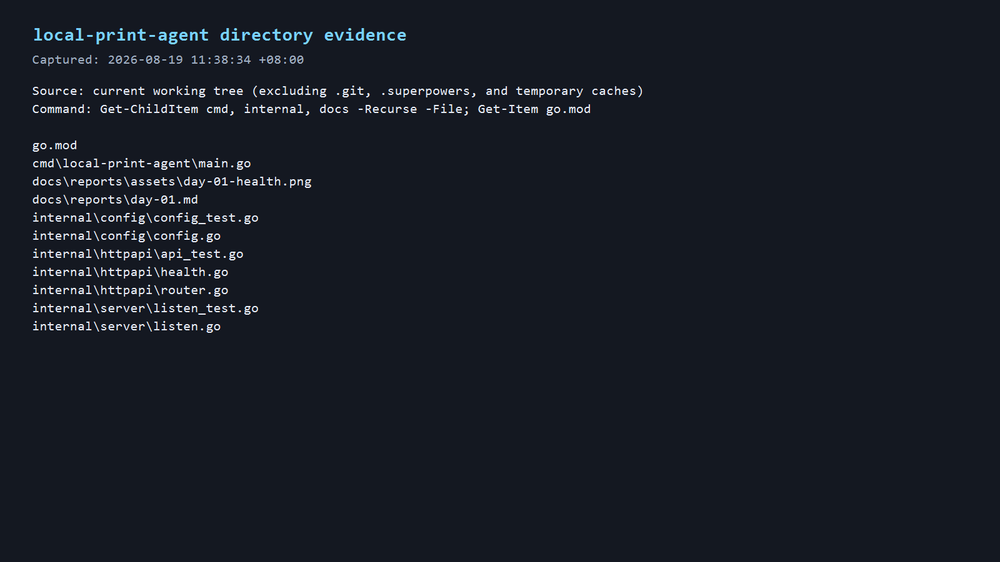
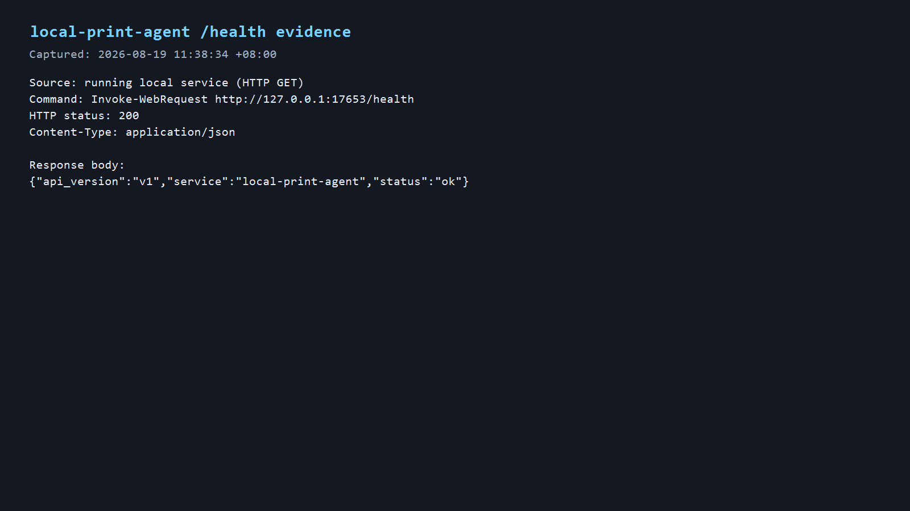

# 第1天：课题范围、主路径与验收口径

## 基本信息

- 课题：课题三。
- 完成方式：独立完成。
- 实践周期：9 天。

## 今日目标

建立本地打印代理仓库的可运行起点，实现候选端口回退和健康检查接口。

## 范围清单

必做：两类打印（HTML 与 PDF）、任务队列、任务状态、失败原因、Windows/Linux 支持、README、录屏。

不做：完整 OJ、账号权限、浏览器插件、云打印、桌面 GUI、打印机驱动、Lodop 集成。

## 主路径与验收口径

主路径：浏览器 → HTTP → 队列 → HTML/PDF → 系统打印 → 状态回传。

程序成功只表示操作系统接受任务；物理出纸另行记录，不能将两者混为同一验收结论。

## 风险与规避

| 风险 | 规避方式 |
| --- | --- |
| Chrome 路径在不同机器不一致 | 后续集中配置可执行文件路径，并在启动时给出可诊断错误。 |
| Windows 打印工具差异 | 后续封装 Windows 系统打印调用，并建立可复现的错误码映射。 |
| Linux CUPS 环境缺失或配置不同 | 后续检测 CUPS 命令和队列状态，README 给出安装与排查步骤。 |
| 中文字体缺失造成版式异常 | 后续提供字体检查和示例任务，在目标系统实机记录结果。 |
| 端口被占用 | 当前按候选端口逐个监听；失败错误会列出每个端口。 |

## 今日证据

- 目录截图：本次工作树的实时目录证据快照；图中列出了用于本任务的 `cmd`、`internal`、`docs` 文件，来源命令和时间戳已写入图内。

  

- `/health` 返回截图：服务运行期间直接执行 HTTP GET 采集，图内记录命令、HTTP 200、JSON Content-Type 和原始响应体。

  

- 截图说明：两张 PNG 均由本次运行实时读取本机目录或本机服务返回后生成的命令输出快照；没有使用合成的响应内容。图内保留了来源、复现命令与采集时间。
- 自动化验证命令：`go test ./... -v`。

  ```text
  ok   local-print-agent/internal/config
  ok   local-print-agent/internal/httpapi
  ok   local-print-agent/internal/server
  ```

- 实机命令：`go run ./cmd/local-print-agent` 后，使用 `Invoke-RestMethod http://127.0.0.1:17653/health`。

  ```json
  {"service":"local-print-agent","api_version":"v1","status":"ok"}
  ```

- 仓库首个提交：`dfd9a8de074b99da812ae7f0c879bc012e0bd495`（`chore: bootstrap repository for isolated development`）。
- 功能实现提交：`cd01ef53c763e8ba0de69184a14e0dcddde74aa8`（`feat: bootstrap local print agent health service`）。
- 第 1 天报告初始提交：`e955b1f4d70de8537694a0b4a21ea4b39b97a3b1`（`docs: add day 1 project report`）。

## 自检

- 第一个候选端口被真实 TCP listener 占用时，测试确认服务回退到下一个候选端口。
- `main` 显式传入 `127.0.0.1`，服务只监听回环地址。

## 明日计划

确定任务对象、状态机、错误码和技术依赖。
