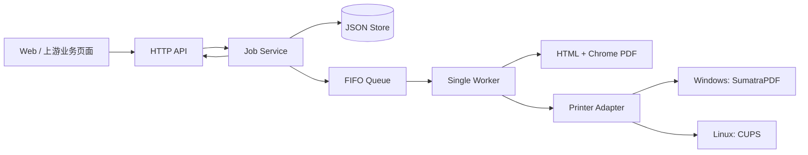
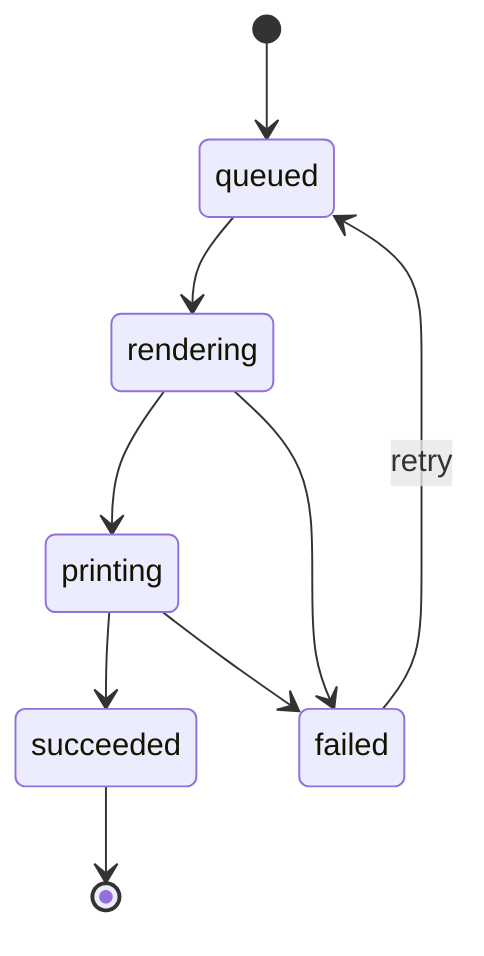

# 课题三日常报告（第 2 天）：系统组成与技术选型

## 基本信息与今日目标

- 课题：浏览器通过 Go 回环服务调用本地打印能力。
- 完成方式：独立完成。
- 今日范围：只确定组件职责、技术依赖、任务模型和状态机，不实现 HTTP 页面或平台打印。
- 今日目标：形成能够直接交给下一阶段编码的接口与验收基线。

## 系统组成



各组件只有一个主要职责：API 负责协议，Service 负责创建和重试，Store 负责持久化，Queue/Worker 负责顺序处理，Renderer 统一生成 PDF，Printer Adapter 隔离平台差异。CCPCOJ 只作为竞赛现场语境参考；由于其 API、鉴权和数据格式没有课程契约，本项目不假定任何对接细节。C-Lodop 只参与方案比较，不作为依赖。

## 需求与验收映射

| 项目范围 | 对应组件 | 后续验收动作 | 成功结果 |
| --- | --- | --- | --- |
| 气球小票与源码打印 | API、Service、Renderer | 分别提交固定 JSON，读取 preview | 气球为窄纸单页；源码有高亮、行号、换行和分页 |
| FIFO 队列 | Service、Queue、Worker | 连续提交多任务并记录处理顺序 | 顺序与提交顺序一致，单 Worker 无重叠 |
| 五状态与重试 | Job、Service、Worker | 执行成功、渲染失败、打印失败和重试 | 只允许文档化迁移；失败保留稳定原因 |
| Windows/Linux 边界 | Printer Adapter | 分别验证命令、枚举和可控系统队列 | 受控命令与真实队列证据分开记录 |
| 可复现交付 | README、脚本、文档 | 在干净副本按 README 启动 | 能探活、创建任务、查询状态并预览 PDF |

## 技术方案比较与结论

### 本地服务

| 方案 | 优点 | 主要限制 | 结论 |
| --- | --- | --- | --- |
| 自研 Go 服务 | 队列、状态、错误和平台边界可控；便于单文件交付 | 需要自行实现存储和适配层 | 选择 |
| 页面直接调用系统命令 | 原型快 | 浏览器无法安全统一执行；没有队列和状态 | 不选择 |
| Go + C-Lodop | 可利用既有桌面打印产品 | 引入外部依赖，且不能替代课程要求的服务契约 | 不选择 |

选择自研 Go 服务，并固定只监听回环地址。系统命令只能由 Adapter 用参数数组调用，不能替代本地服务或由页面拼接。

### 渲染

| 方案 | 优点 | 主要限制 | 结论 |
| --- | --- | --- | --- |
| 纯文本直接打印 | 实现简单 | 难以稳定实现票据、高亮和分页 | 不选择 |
| HTML + Chroma + Chromedp | 模板、CSS 和高亮能力完整；两平台统一输出 PDF | 需要受控 Chrome/Chromium | 选择 |
| 纯 Go PDF 库 | 可减少浏览器依赖 | 复杂文本布局、语法高亮和分页需自行实现 | 不选择 |

Chroma 负责源码高亮，HTML 模板负责业务版式，Chromedp 将两类页面固化为 PDF。平台 Adapter 因此只处理同一种 PDF 输入。

### 打印适配

| 环境 | 方案 | 本阶段证据要求 |
| --- | --- | --- |
| Windows | SumatraPDF 静默提交 | 先验证参数、allowlist 和错误；再在安全目标上补系统队列证据 |
| Linux | CUPS 的 `lp`/`lpstat` | 先验证解析和参数；再在 Linux runtime 补 request id 与队列证据 |
| 自动测试与默认演示 | Fake Printer | 可重复模拟成功/失败，并明确“不执行实体打印” |

## 任务对象与状态机

```json
{
  "id": "32位小写十六进制任务ID",
  "type": "balloon_ticket",
  "printer_name": "front-desk",
  "payload": {
    "team_name": "Team Atlas",
    "problem_id": "A",
    "solved_at": "2026-08-19T09:30:00+08:00"
  },
  "status": "queued",
  "attempts": 0,
  "created_at": "2026-08-19T09:30:05+08:00",
  "updated_at": "2026-08-19T09:30:05+08:00"
}
```



进入 `rendering` 时写入 `started_at` 并令 `attempts + 1`；进入成功或失败终态时写入 `finished_at`；失败重试回到 `queued` 时清理上次运行时间和旧错误。错误统一为 `{"code":"RENDER_FAILED","message":"PDF rendering failed"}` 形式，对外使用稳定大写错误码。

## 今日完成与验收

| 前提 | 操作 | 预期结果 | 实际结果与结论 |
| --- | --- | --- | --- |
| 新建任务为 `queued` | 依次执行合法状态迁移 | 只能到 `rendering -> printing -> succeeded` | 状态机测试通过 |
| 任务处于不允许的状态 | 尝试跳级、倒退或重复完成 | 返回 `INVALID_TRANSITION`，原状态不变 | 三类非法路径测试通过 |
| 失败任务发起重试 | 执行 `failed -> queued` | 清理旧错误和运行时间；下一次渲染才增加 attempts | 生命周期测试通过 |
| 需要选择实现方案 | 对服务、渲染和打印分别比较候选 | 每项均有选择理由、依赖与后续验收方式 | 已形成本文三张选型表 |

新增状态机测试初次运行时，因为 `CanTransition`、`Transition`、生命周期字段和 `JobError` 尚未实现而编译失败；完成实现后运行：

```text
go test ./internal/jobs -run 'Test(CanTransition|Transition)' -v
PASS
```

实现提交：`098ceb2d57f1c362d553c40288147a3d6929b912`（`feat: define print job model and state machine`）。

## 问题、AI 沟通与自检

主要问题是容易根据 CCPCOJ 或 C-Lodop 的公开形态猜测本项目接口，导致范围扩张。本日要求 AI 只比较可验证的架构特征，并明确“没有课程契约就不得假定上游 API、鉴权和数据格式”。这个约束使选型报告保留借鉴价值，又不会把未知集成写进必做范围。

自检结果：每项必做都能映射到组件和后续验收；状态名、生命周期字段和错误对象已经可以直接交给 Store、Service 和 Worker 使用；尚未完成的 HTTP、Web、真实渲染和平台队列没有写成今日成果。

## 明日计划

交付 JSON Store、容量 100 的 FIFO、Job Service、单 Worker、Fake Renderer 和 Fake Printer；用两条确定性测试记录成功状态全序列与渲染/打印失败序列，并说明服务重启和重复打印边界。
