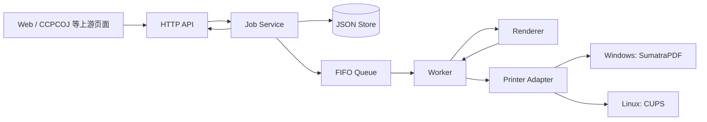
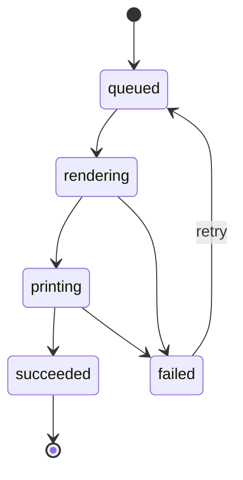

# 第2天：系统组成、需求映射与技术选型

## 系统组成



CCPCOJ 仅在本报告中定位为可能的上游业务系统；尚未确认其 API、鉴权或数据格式，因而没有假定任何对接细节。C-Lodop 仅作为下文比较的候选方案，没有把其具体能力或接口作为本项目依赖。

## 需求映射与验收方法

| 指导书要求 | 对应组件 | 验收方法 |
| --- | --- | --- |
| 两类打印：HTML 与 PDF | API、Job Service、Renderer | 提交两类合法任务，检查生成的 PDF 和状态记录 |
| 任务队列 | JSON Store、FIFO Queue、Worker | 连续提交任务，检查先进先出处理次序 |
| 任务状态 | Job、Service、Worker | 单元测试覆盖所有合法/非法状态流转；查询任务状态 |
| 失败原因 | `JobError`、Renderer、Printer Adapter | 制造渲染/打印失败，检查稳定错误码和可读消息 |
| Windows/Linux 支持 | Printer Adapter | Windows 使用 SumatraPDF、Linux 使用 CUPS 的独立验收 |
| README | README | 按干净环境的启动和配置步骤复现 |
| 录屏 | API、Worker、查询接口 | 录制创建、处理、成功/失败查询的完整主路径 |

## 技术方案比较

### 服务方案

| 方案 | 优点 | 限制 | 结论 |
| --- | --- | --- | --- |
| 自研 Go 服务 | 本地回环接口、队列/状态/错误可控，跨平台适配集中 | 需要实现存储和适配层 | 选择 |
| 直接系统命令 | 原型很快 | 无统一 API、队列、持久状态和失败语义 | 不选择 |
| Go + C-Lodop | 可能适配特定桌面工作流 | 本项目范围未确认其集成契约，增加外部依赖 | 不选择 |

选择自研 Go 服务：它直接覆盖本地 HTTP、任务状态、持久化队列和 Windows/Linux 打印适配这些可验收边界；系统命令由适配层调用而不是替代服务。

### 渲染方案

| 方案 | 优点 | 限制 | 结论 |
| --- | --- | --- | --- |
| 纯文本 | 实现简单 | 难以保证票据和代码的 HTML 排版 | 不选择 |
| HTML + Chrome | 浏览器排版一致，适合模板化任务 | 需要受控 Chrome 可执行文件 | 选择 Chroma + Chromedp |
| 第三方 PDF 库 | 可减少浏览器依赖 | 复杂排版需自行实现 | 不选择 |

Chroma 负责源码高亮，Chromedp 驱动 Chrome 把 HTML 固化为 PDF；最终打印只面向 PDF，降低平台差异。

### 打印适配

| 环境 | Adapter 实现 | 本阶段验收 |
| --- | --- | --- |
| Windows | SumatraPDF | 命令参数与操作系统接收结果 |
| Linux | CUPS | 队列提交结果和可诊断错误 |
| 测试 | Fake Printer | 可重复地模拟成功与失败状态 |

## 任务示例与状态机

```json
{
  "id": "job-20260819-0001",
  "type": "balloon_ticket",
  "printer_name": "front-desk",
  "payload": {
    "team_name": "Team Atlas",
    "problem_id": "A",
    "solved_at": "2026-08-19T09:30:00+08:00"
  },
  "status": "queued",
  "attempts": 0,
  "created_at": "2026-08-19T09:30:05+08:00",
  "updated_at": "2026-08-19T09:30:05+08:00"
}
```

失败任务的 `error` 是统一对象，例如 `{"code":"print_failed","message":"printer offline"}`。当前稳定错误码包括 `invalid_transition`、`render_failed` 和 `print_failed`。



进入 `rendering` 时写入 `started_at` 并使 `attempts + 1`；失败或成功时写入 `finished_at`；重试进入 `queued` 时将运行时间、完成时间和旧错误清理为 `nil`，因此 queued JSON 不包含 `started_at`/`finished_at`，下一次真正渲染才增加尝试次数。

## 今日完成

- 完成任务模型的生命周期字段：`started_at`、`finished_at`、`attempts`。
- 完成请求校验与规范化。
- 完成唯一合法状态机路径、非法流转拒绝和统一 `JobError`。
- 统一错误码：`invalid_transition`、`render_failed`、`print_failed`。

## 今日证据

- 红灯：新增状态机测试首次运行，因 `CanTransition`、`Transition`、生命周期字段和 `JobError` 尚未实现而编译失败。
- 绿灯：实现后运行 `go test ./internal/jobs -run 'Test(CanTransition|Transition)' -v`，全部通过；测试包括合法路径、三个非法路径、尝试次数、时间字段和错误保留/清理。
- 实现提交：`098ceb2d57f1c362d553c40288147a3d6929b912`（`feat: define print job model and state machine`）。

## 明日计划

实现 JSON Store、FIFO 队列，以及 Fake Renderer/Fake Printer 主路径，打通创建任务到成功或失败的完整状态流转。
