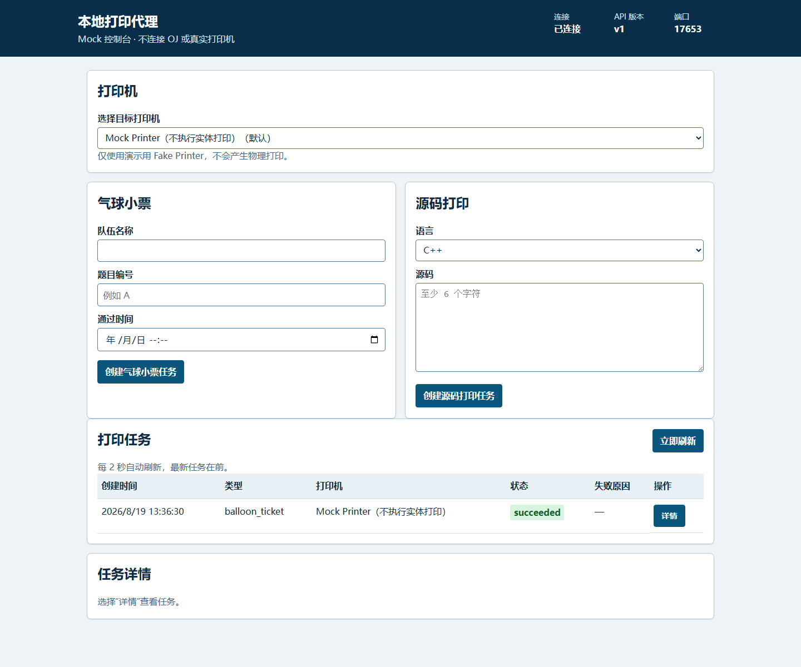

# 第4天：环境起步、启动说明、目录职责与审查

## 启动与预期结果

在仓库根目录运行：

```powershell
powershell -ExecutionPolicy Bypass -File .\scripts\run-windows.ps1
```

```bash
bash ./scripts/run-linux.sh
```

终端会输出类似 `local-print-agent listening on http://127.0.0.1:17653`。打开该 URL 后，`GET /health` 返回服务、版本和状态；页面显示一个 Mock Printer。创建气球或源码任务后，任务会显示为成功；Fake Printer 只记录命令，不会产生实体打印。

## 目录职责

```text
cmd/local-print-agent/      可执行程序装配、端口监听和优雅关闭
internal/config/            本地监听与数据目录配置
internal/httpapi/           版本化 JSON API、CORS 和嵌入网页路由
internal/jobs/              任务模型、验证、状态流转及安全恢复入队
internal/printer/           打印机适配器接口和无实体输出的 Fake
internal/render/            渲染器接口和可识别的假 PDF 输出
internal/server/            候选端口监听
internal/store/             JSON 持久化与中断任务恢复
internal/worker/            FIFO 工作器和重试处理
web/                         嵌入式单页控制台资源
scripts/                     Windows/Linux 从仓库根启动入口
docs/reports/                每日说明、审查记录和截图
```

## API

| 方法 | 路径 | 输入 | 成功 | 失败 |
| --- | --- | --- | --- | --- |
| GET | `/health` | 无 | 200 | 405 |
| GET | `/api/v1/printers` | 无 | 200 | 500、503 |
| GET | `/api/v1/print-jobs` | 无 | 200 | 503、500 |
| POST | `/api/v1/print-jobs` | `type`、`printer_name`、`payload` | 202 | 400、415、413、503、500 |
| GET | `/api/v1/print-jobs/{id}` | 路径 ID | 200 | 404、503、500 |
| POST | `/api/v1/print-jobs/{id}/retry` | 路径 ID | 200 | 404、409、503、500 |
| GET | `/api/v1/print-jobs/{id}/preview` | 路径 ID | — | 501（当前未实现） |

Day 4 初版曾仅凭 `Origin: null` 开放 GET、POST 和 `Content-Type` 预检。最终安全审查已加固：默认使用嵌入式同源页面；可选 `file://` 页面还必须为每个 health/API/preview URL 携带本次启动在本地终端输出的随机能力值，缺失或错误值不获得 CORS，普通网页 Origin 也不授权。

## 页面截图

真实运行中的网页（服务已连接、两种表单与任务列表）：



## 审查纪要

- 端口：主进程只通过候选监听器查找 17653–17660；静态页面探测同一范围并验证 health 标识。
- 命令：启动脚本不拼接用户输入；从脚本路径回到仓库根后固定执行 Go 入口。
- 源码保护：工作器错误消费只记录固定说明，不记录错误文本，避免意外写入源码内容。
- 状态：重试仅接受 `failed`；恢复时只补入 `queued`，容量超过 100 时明确失败且不部分投递。
- 职责：网页只负责操作 API；持久化、队列、渲染和打印各自独立。

## 当前 Fake 边界

页面与主 API 流程已可演示。Fake renderer 生成带 Catalog、Page、Helvetica 内容流、xref/trailer 的最小合法单页 PDF，页面文本明确标识 `FAKE RENDERER` 和任务 ID；它不是 HTML/Chromedp 渲染。Fake Printer 仅记录命令；没有真实 PDF 预览或平台打印。

修正复验：2026-08-19 使用实际创建的 Fake 源码任务运行 MiKTeX `pdfinfo`，返回 0，并报告 1 页、612×792 points、PDF 1.4。网页错误提示现在按操作来源管理：预览 501 不会被后台两秒刷新成功清除，且刷新失败会继续向创建/重试调用方报告失败。浏览器自动化连接受本机 DevTools 500 策略阻断，行为由网页静态回归契约覆盖。

## 明日计划

增加两种 HTML 模板、Chroma 高亮、Chromedp PDF，并形成可演示的真实渲染版本。
