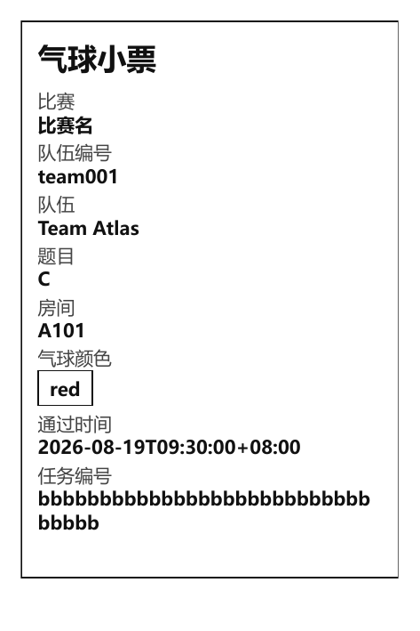
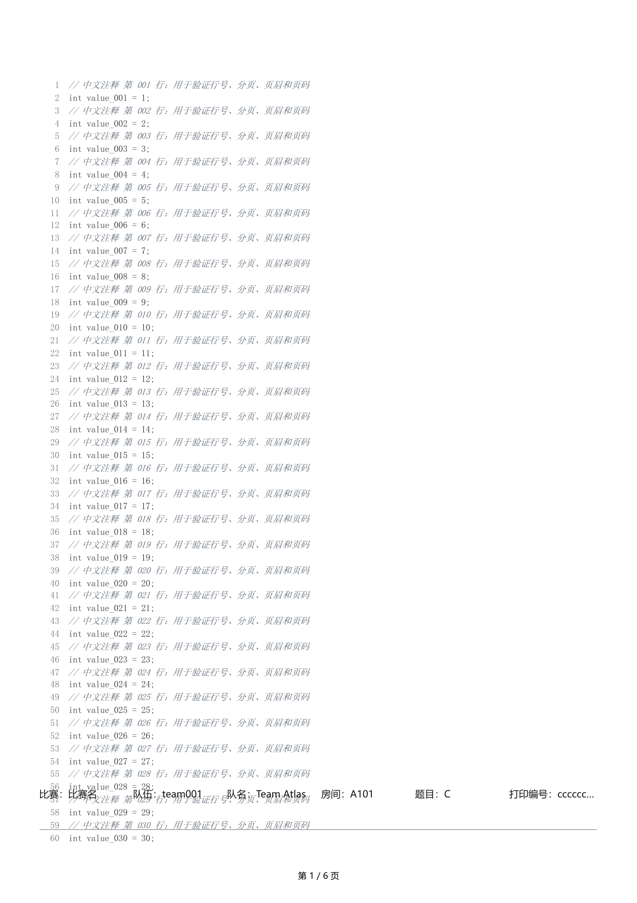
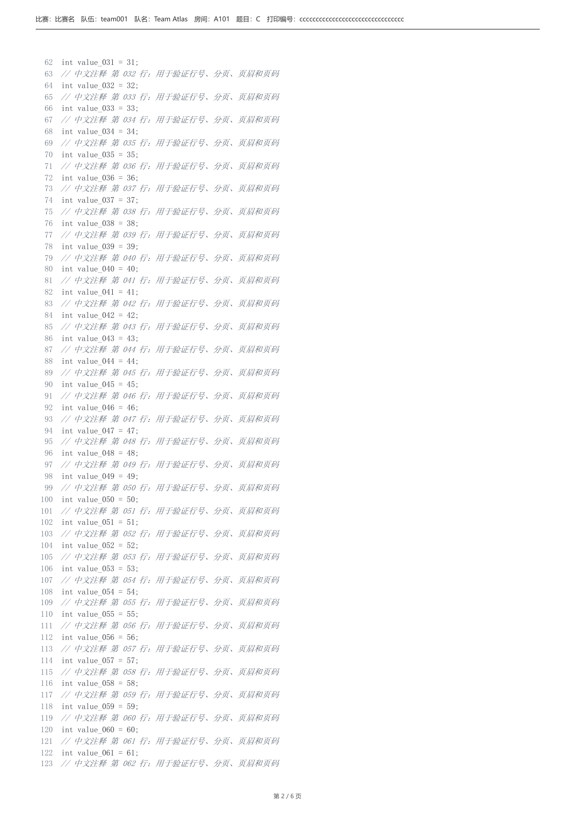

# 课题三日常报告（第 5 天）：真实 PDF 渲染与演示复现

## 基本信息

- 课题：浏览器调用本地打印机（课题三）。
- 成员：独立完成。
- 日期：2026 年 8 月 16 日。

## 今日目标

把 Fake Renderer 替换为真实 HTML -> PDF 流程并开放 preview 路由；形成一份可按文字复现的主路径演示说明，并确认他人（或换环境）照做能走通；把未完成项整理成可排期的差距清单。

## 演示说明

前提：Go 1.23+；Chrome/Chromium 131+（服务按环境变量、PATH 和常见安装位置自动发现）。打印机仍为 Fake Printer，页面显示“Mock Printer（不执行实体打印）”——本日 `succeeded` 不构成任何打印证据。

1. 启动服务：`powershell -ExecutionPolicy Bypass -File .\scripts\run-windows.ps1`（Linux 用 `bash ./scripts/run-linux.sh`）。预期：终端输出回环监听地址。
2. 探活：`curl http://127.0.0.1:17653/health`。预期：200，`"service":"local-print-agent"`、`"status":"ok"`。
3. 提交气球任务（`testdata/balloon.json`，中文队名）：`curl -X POST .../api/v1/print-jobs -H 'Content-Type: application/json' --data @testdata/balloon.json`。预期：202 与 32 位十六进制任务 ID。
4. 轮询详情至 `succeeded`。预期：attempts=1，`pdf_path` 指向任务目录。
5. 打开 preview：`curl -o preview.pdf .../api/v1/print-jobs/{id}/preview`。预期：200、`application/pdf`；打开后为 80 x 120 mm 单页，中文队名、题号、颜色与通过时间可见（真实 Chrome 渲染）。
6. 提交 140 行含中文注释的 C++（`testdata/source_cpp.json`）。预期：多页 A4；高亮、连续行号、长行换行、页眉与“第 n / N 页”页码，实测 6 页。
7. 分段请求：`curl -H 'Range: bytes=0-99' .../preview`。预期：206，内容与完整请求同源。
8. 停止：启动终端 Ctrl+C。预期：进程退出、端口可重新绑定、临时 Chrome profile 被清理。

关键界面截图：

气球小票：

源码首页（中文注释、行号、页眉页码）：

源码第二页（分页后行号连续、间距正常）：

## 复现情况

本人先在开发机完成上述 8 步（第一遍，顺畅），随后在一台独立测试机按说明文字跟做第二遍：无需修改说明，服务自动发现该机 Chrome major 151 并通过版本校验，两类任务与 preview 均复现成功。两遍的真实任务 ID：气球 `09a23714981d6043aa7d682574188db3`、源码 `7056cddfeef0d09741416758f5628b01`。

需要如实记录的边界：本机普通账户无权创建 symlink，相关 preview 越界用例标为 skip；非 symlink 的越界、错误文件名与 Store 篡改测试均实际运行。此外受限桌面环境下的 Chrome 复跑在第 7 天出现 `context canceled`，该失败按日期保留在第 7 天报告中，不用本日成功覆盖。

## 差距清单

| 内容 | 优先级 | 计划完成 | 备注 |
| --- | --- | --- | --- |
| 打印机枚举 + Windows SumatraPDF Adapter | 高 | 第 6 天 | 受控 runner 自测 |
| Linux CUPS Adapter 与 build-tag 测试 | 高 | 第 6 天 | 当前无 Linux runtime，先交叉编译 |
| 显式 demo/platform 模式与启动脚本参数 | 高 | 第 6 天 | 默认必须安全 |
| 系统队列接受与隔离输出证据 | 高 | 环境具备时 | 需安全虚拟队列，禁止向实体设备试投 |
| 浏览器/Node 执行真实 `app.js` 行为测试 | 中 | 第 7 天 | DevTools 策略阻断浏览器自动化 |
| symlink 越界用例 | 低 | 环境具备时 | 普通账户无权创建 |

## 今日完成与自检

主路径今天实际做到：真实 Chrome 渲染两类 PDF + 安全 preview（200/206）。版本检查失败返回 `RENDERER_NOT_FOUND` / `RENDERER_VERSION_UNSUPPORTED`；PDF 未生成时 preview 返回 409；HTML/PDF 先写同目录临时文件再原子替换。自动测试中 Chrome 集成测试输出：`Chromium major: 151`、`source PDF pages: 6`、两页几何（页眉横线 y=62、正文 y=139/127、页码 y=1710、页高 1754）断言通过。

自检：演示说明两遍可跟做；Fake Printer 边界在步骤中已标明；未完成项全部进入差距清单，无遗漏口径。

## 问题、计划与 AI 沟通

- 不成功的沟通一例：早期源码页脚用页面内固定元素，多页时覆盖底部正文。当时只让助手“检查 CSS 字符串”，它确认无误但产物仍是错的——字符串正确不代表 PDF 几何正确。
- 比较有效的沟通一例：把约束改为“必须基于真实 Chrome 产物，测量页眉、正文和页脚的像素位置”后，改用 CDP 页眉/页脚与显式页边距，几何断言复测通过，三张截图成为可读证据。
- 明日安排：按差距清单优先完成两块——Windows SumatraPDF Adapter 与 Linux CUPS Adapter（含 demo/platform 模式装配）。
