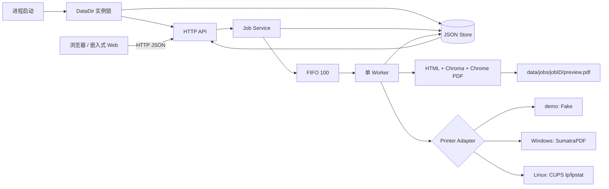
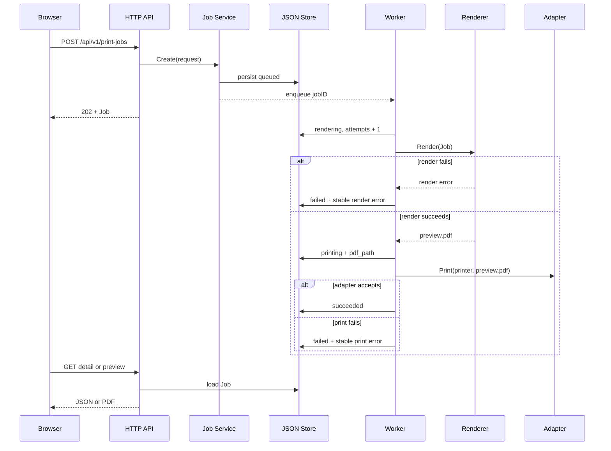
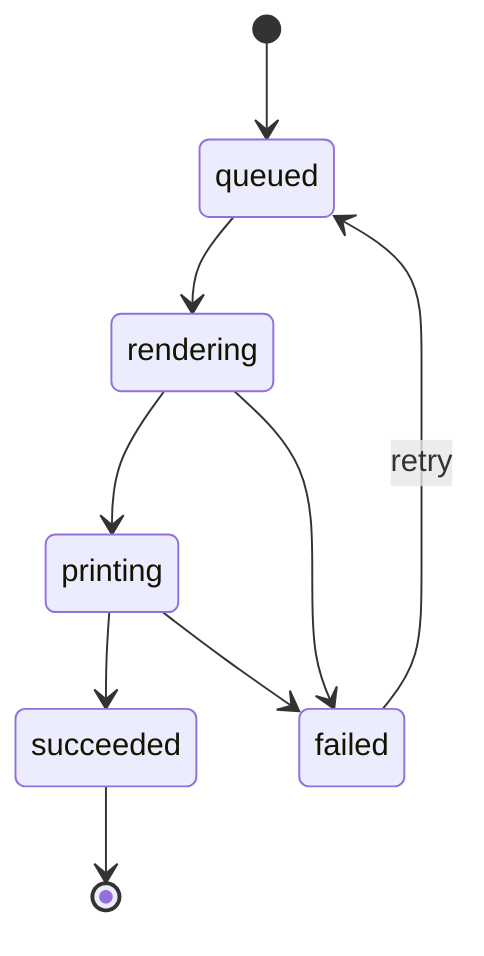

# 第 9 天：浏览器调用本地打印机课程项目结课报告

- 结课日期：2026-08-20
- 课题：课题三，浏览器通过 Go 回环服务调用本地打印能力
- 开发周期：9 天
- 提交边界：本报告只总结已有实现与证据，不新增功能、不改变 API 或核心行为

## 1. 摘要

本项目实现了一个 Go 本地打印代理。浏览器通过仅监听 `127.0.0.1` 的 HTTP 服务提交气球小票或源代码任务；服务先持久化任务，再由容量 100 的单 Worker FIFO 依次完成 HTML 生成、Chrome/Chromium PDF 渲染、打印适配器调用和状态回写。系统提供 7 个 HTTP 接口、嵌入式 Mock Web、JSON 持久化、失败原因、失败任务重试、安全 PDF 预览，以及 Windows SumatraPDF 和 Linux CUPS 两个平台适配边界。

当前可复现的主证据是 Windows `demo` 模式：浏览器由脚本自动发现，`/health` 返回 `service=local-print-agent`、`status=ok`、API `v1`，打印机为“Mock Printer（不执行实体打印）”；任务 `809b3c736979ffe2ac9466441f8c4fa2` 最终为 `succeeded`、`attempts=1`，预览返回 HTTP 200、`application/pdf`、35,180 bytes，停止后端口释放。该证据没有访问操作系统打印队列。

自动验证基线为 152 个顶层测试：146 通过、6 跳过、0 失败；12 个含测试包通过，race 检查 12 个包且 0 race，vet、module verify 和 diff 检查通过。Windows 平台适配器已由受控 runner 验证；Linux 适配器、新增实例锁和主应用已完成交叉编译，但没有在 Linux 内核运行，也没有 CUPS request id。真人同学仅看 README 启动、Windows 安全虚拟/系统队列录屏、Linux/CUPS runtime 与录屏均未完成。本报告不以 Fake Printer、受控 runner、Windows demo、交叉编译、历史截图或代理审查替代这些人工证据，也不声称录屏已经独立完成。

## 2. 课题背景与项目目标

普通网页不能在不同浏览器和操作系统上安全、统一地直接枚举或驱动本地打印机。让网页任意读取文件路径、拼接系统命令或静默选择设备，会扩大本机权限和命令注入风险。课题三因此需要一个边界清晰的本地组件：网页只提交结构化业务数据，本地服务负责队列、渲染、平台命令和可审计状态。

本项目面向竞赛现场的两类高频材料：气球派发小票和带行号的源代码。9 天目标如下：

1. 在回环地址提供可发现、可查询的本地 HTTP 服务。
2. 将请求持久化为任务，以 FIFO 单线程处理并记录完整生命周期。
3. 将气球和源码业务数据转成可预览、可归档的 PDF。
4. 通过明确选择的适配器连接 Windows 或 Linux 打印边界，同时默认不访问系统队列。
5. 对请求、文件路径、外部命令、错误文本和服务恢复建立安全约束。
6. 形成 README、API、测试、演示脚本、Day 1-9 报告和可核对证据。

验收口径始终分层：`demo` 的 `succeeded` 只表示 Fake Adapter 接受调用；`platform` 的 `succeeded` 只表示平台命令返回成功；两者都不自动等于物理出纸。

## 3. 必做、不做与最终范围

### 3.1 必做与不做矩阵

Day 1 的必做和不做范围来自 `docs/reports/day-01.md`。本项目没有用新增功能掩盖未完成项；状态与第 15 节一致。

| 类别 | 项目 | 最终状态/适用性 | 证据或影响 |
| --- | --- | --- | --- |
| 必做 | 两类打印（原文“HTML 与 PDF”） | 部分完成 | `internal/render/` 和 `templates/` 实现气球/源码 HTML -> PDF；没有任意 HTML 输入或现成 PDF 上传 |
| 必做 | 任务队列 | 完成 | `internal/jobs/service.go`、`internal/worker/worker.go`；容量 100 的单 Worker FIFO |
| 必做 | 任务状态 | 完成 | `internal/jobs/state.go`；5 个状态和失败重试路径 |
| 必做 | 失败原因 | 完成 | `internal/jobs/model.go`、`docs/api.md`；稳定错误码和可读消息 |
| 必做 | Windows/Linux 支持 | 部分完成 | 两个平台 Adapter 已实现；Windows 系统队列、Linux/CUPS runtime 和录屏未完成 |
| 必做 | README | 完成 | `README.md` 和 Windows demo 干净副本证据；真人同学验收未完成 |
| 必做 | 录屏 | 未完成 | `docs/demo-script.md` 已完成，但仓库没有实际录像文件 |
| 不做 | 完整 OJ、判题、榜单 | 不适用，保持不做 | CCPCOJ 只作现场语境参考，不集成 |
| 不做 | 账号与权限系统 | 不适用，保持不做 | 当前服务固定为本机回环工具 |
| 不做 | 浏览器插件、桌面 GUI、云打印 | 不适用，保持不做 | Web 只调用本机 HTTP API |
| 不做 | 自研打印机驱动 | 不适用，保持不做 | 平台边界使用 SumatraPDF 或 CUPS |
| 不做 | Lodop 集成 | 不适用，保持不做 | Lodop 只作商业方案比较 |

### 3.2 范围澄清

2026-08-19 的 Day 2 至 Day 5 将“HTML 与 PDF”落实为气球小票和源码两类业务任务，处理链统一为“结构化 JSON -> 自包含 HTML -> PDF -> Adapter”。这样做的原因是统一预览、归档与双平台打印输入，并避免开放任意本地文件路径。影响是：当前 API 不接受用户提交的任意 HTML 文件，也没有“上传现成 PDF”的任务类型。因此，如果按 Day 1 文字的字面含义要求原始 HTML 输入和原始 PDF 输入，这一项只能记为部分完成；已有证据只证明两类业务 HTML 均可生成和预览 PDF。

其余核心范围没有扩大：状态机、FIFO、失败原因、Windows/Linux Adapter、README 和演示材料仍与 Day 1 对齐。Day 9 只整理报告。

### 3.3 不做边界说明

不实现完整 OJ、账号与权限系统、浏览器插件、桌面 GUI、云打印、自研打印机驱动或 Lodop 集成；不做并行打印、多进程数据库或 exactly-once 的操作系统提交；不接受客户端文件路径；不向未经确认的实体或交互式虚拟打印目标试投。

## 4. CCPCOJ 与 Lodop 参考分析

### 4.1 CCPCOJ

CCPCOJ 只用于理解竞赛现场打印队列的业务语境。本项目借鉴了任务编号、排队、现场分发字段和可审计状态：jobID 同时出现在任务、气球票和源码页眉；比赛、队伍、房间和题号在两类模板中保持一致；失败任务可按 ID 查询和重试。

本项目没有读取或假设 CCPCOJ 的 API、鉴权、数据库或消息格式，没有与其集成，也没有实现判题、榜单或账户系统。Web 表单是独立演示入口，未来上游系统只能通过已公开的本地 API 提交结构化数据。

### 4.2 Lodop/C-Lodop

Lodop 只作为商业方案比较。借鉴点是“网页调用本机服务”的产品边界、纸张设置、预览与直接打印的职责分离。未选择集成的原因是课程需要独立展示 Go 服务、任务持久化、状态机、失败语义和双平台适配，加入商业组件会引入额外运行依赖，也无法替代这些课程验收内容。

因此，本项目与 CCPCOJ、Lodop 均无代码、协议或运行依赖关系。

## 5. 需求分析

| 需求 | 输入 | 处理 | 可观察输出 | 验收依据 |
| --- | --- | --- | --- | --- |
| 服务发现 | 浏览器或 HTTP GET | 在 17653-17660 选择首个可用回环端口 | health 的服务名、API 版本和状态 | `TestHealthReturnsServiceStatusJSON`、`TestListenFirstAvailableFallsBackWhenFirstPortIsOccupied` |
| 气球小票 | 队名、题号、RFC3339 时间及可选现场字段 | 校验、HTML 模板、Chrome PDF | 80 mm x 120 mm PDF、任务状态 | `TestRenderBalloonHTMLShowsRequiredTicketDetailsAndEscapesMetadata`、Day 5 截图 |
| 源码打印 | `cpp/go/python/java`、6-65536 UTF-8 bytes 源码及元数据 | 保留源码空白、Chroma 高亮、A4 分页 | 行号、高亮、页眉、页码和多页 PDF | `TestNormalizeCreateRequestPreservesSourceWhitespaceAndTabs`、`TestPDFRendererChromeIntegration` 的历史实跑证据 |
| 队列与状态 | 合法创建请求 | JSON Store 后入容量 100 FIFO，由单 Worker 处理 | `queued/rendering/printing/succeeded/failed` | `TestWorkerProcessesTwentyJobsFIFOWithoutOverlap`、状态机测试 |
| 失败与重试 | 渲染/打印/存储失败或服务重启 | 稳定错误码、失败持久化、仅失败任务可重试 | `error.code/message`、attempts 和时间字段 | Worker、Service、Store 失败注入测试 |
| 平台适配 | 显式 `platform` 模式和目标队列 | Windows SumatraPDF 或 Linux CUPS 参数数组 | Adapter 返回结果或稳定错误 | Windows 受控测试已运行；Linux 受控测试代码已交叉编译，runtime 未完成 |
| 安全预览 | Store 中的已生成 PDF | 校验 jobID、根目录、固定文件名和链接边界 | 200/206 PDF 或稳定错误 | `TestAPIPreviewServesOnlyStoredJobPDFWithSafeHeadersAndRange` |

非功能要求包括：默认安全、项目相对文档路径、跨平台启动脚本、可恢复持久化、错误脱敏、可取消清理、可重复自动测试，以及人工证据与自动证据不混用。

## 6. 总体架构



主路径时序如下：



关键目录职责：

| 路径 | 职责 |
| --- | --- |
| `cmd/local-print-agent/` | 应用装配、监听、信号、HTTP 与 Worker 协同关闭 |
| `internal/config/` | 固定回环地址、候选端口、数据目录和打印模式 |
| `internal/instance/` | Windows `LockFileEx`、Unix `Flock` 数据目录实例锁 |
| `internal/httpapi/` | 7 个接口、统一 envelope、CORS、静态 Web 和 preview |
| `internal/jobs/` | Job、输入规范化、状态机、Service 和 FIFO 发送端 |
| `internal/store/` | JSON 原子替换、克隆隔离、排序和重启恢复 |
| `internal/worker/` | 单 goroutine 主路径、失败持久化和有界指数退避 |
| `internal/render/` | 气球/源码 HTML、Chrome 发现、PDF 生成和安全发布 |
| `internal/printer/` | Fake、Windows SumatraPDF、Linux CUPS Adapter |
| `templates/`、`web/` | 嵌入式打印模板和 Mock Web 控制台 |
| `scripts/`、`testdata/`、`docs/` | 双平台入口、验收数据和交付文档 |

`startWithBuilder` 在应用 builder、Store 打开和重启恢复之前非阻塞取得实例锁。builder、listener 或其他启动阶段失败都会释放；成功启动后，锁只在 HTTP `Shutdown` 明确完成且 Worker `Done` 后释放。`running.Done` 因而同时代表 handler 排空、Worker 清理、端口和数据目录所有权释放。

## 7. 任务模型与状态机

Job 的核心字段是 `id`、`type`、`printer_name`、`payload`、`status`、`error`、`created_at`、`updated_at`、`started_at`、`finished_at`、`attempts` 和 `pdf_path`。ID 使用 128-bit `crypto/rand`，编码为 32 位小写十六进制。Service 在入队前先持久化，列表按创建时间和 ID 排序。



进入 `rendering` 时写 `started_at`、清旧错误并使 `attempts + 1`；`failed` 和 `succeeded` 写 `finished_at`；重试只允许 `failed -> queued`，清空本次运行时间和旧错误，但 attempts 保留到下一次进入 rendering 再增加。

JSON Store 用同目录临时文件、flush 和单次替换写入。重启时，遗留在 `rendering` 或 `printing` 的任务被标记为 `failed/SERVICE_RESTARTED`，原有 `queued` 任务按创建顺序恢复入当前进程的私有队列。同一 DataDir 的另一个进程会在 Store 打开、恢复或排队前因实例锁失败，不能通过候选端口回退共享快照。系统保证进程内最终状态持久化重试不会再次调用 `Print`；但平台命令已接受、`succeeded` 尚未落盘时崩溃，人工重试仍可能重复提交，所以平台边界是 at-least-once，不是 exactly-once。

## 8. HTTP API 与 Mock Web

除 `/health` 外，JSON 接口统一返回 `{"data":...,"error":null}` 或 `{"data":null,"error":{"code":"...","message":"..."}}`。当前路由恰好 7 个：

| 方法 | 路径 | 成功 | 主要失败 |
| --- | --- | --- | --- |
| GET | `/health` | 200，兼容性发现响应 | 405 |
| GET | `/api/v1/printers` | 200，打印机数组 | 500、503、405 |
| POST | `/api/v1/print-jobs` | 202，完整 Job | 400、413、415、503、500、405 |
| GET | `/api/v1/print-jobs` | 200，Job 数组 | 503、500、405 |
| GET | `/api/v1/print-jobs/{jobID}` | 200，Job | 404、503、500、405 |
| GET | `/api/v1/print-jobs/{jobID}/preview` | 200 或 206，PDF | 404、409、416、503、500、405 |
| POST | `/api/v1/print-jobs/{jobID}/retry` | 200，重新排队后的 Job | 404、409、503、500、405 |

创建请求体上限为 1 MiB，顶层和 payload 均拒绝未知字段及多余 JSON 值。异步 Worker 可能在客户端读取 202 前推进状态，因此调用方不能假设创建响应一定仍是 `queued`。

Mock Web 嵌入可执行文件，默认直接打开服务输出的回环 URL，与 API 同源；页面展示打印机、两类表单、按时间倒序的任务列表、详情、预览和失败重试，每 2 秒刷新。动态错误通过 `textContent` 写入。可选 `file://` 模式使用每次启动由 256-bit `crypto/rand` 生成并只在本地终端指令中显示的能力值；页面把它附到 health、所有 API fetch 和 preview URL。Router 对正确能力值使用固定长度 digest 的常量时间比较，只有同时满足 `Origin: null`、API 路径和能力正确才返回窄范围 CORS；缺失、错误或空配置均不授权。能力值不进入 Job 或错误载荷。Node 行为测试分别验证同源发现/渲染/轮询，以及 file 模式的全请求与 preview 传播。

完整字段、响应和双端命令见 `docs/api.md`。

## 9. 气球小票渲染

气球任务类型是 `balloon_ticket`。必填字段为 `team_name`、`problem_id` 和 RFC3339 `solved_at`，可选比赛名、队伍编号、房间和气球颜色。`templates/balloon_ticket.html.tmpl` 使用 `@page { size: 80mm 120mm; margin: 4mm; }`，Go `html/template` 自动转义业务文本，空的可选字段显示“未提供”。

`internal/render/balloon.go` 只接受气球 Job，并严格解码 payload；`internal/render/pdf.go` 将生成的 HTML 写入私有 job 目录，再由 Chrome/Chromium 生成 `preview.pdf`。Day 5 的真实 Chrome 151 证据显示小票为 1 页，截图如下：

截图文件：`docs/reports/assets/day-05-balloon.png`（Day 5 气球小票真实 PDF）。

该截图证明历史 PDF 版式，不证明任何系统队列接受或物理出纸。

## 10. 源代码高亮与分页

源码任务类型是 `source_code`，支持 `cpp`、`go`、`python`、`java`。源码必须包含非空白内容，长度为 6-65536 个 UTF-8 bytes。元数据会去除首尾空白，`source_code` 本身保持原始字节，因此首行 Tab、内部缩进和末尾换行不会被规范化删除。

`internal/render/source.go` 用 Chroma 的 GitHub style 生成已转义的 token HTML，并开启行号。只有 Chroma 生成且已经转义的片段进入受信 `template.HTML`；用户元数据仍由模板转义。`templates/source_code.html.tmpl` 使用 A4、`pre-wrap`、`overflow-wrap`、每行 flex 结构和固定行号列处理长行。Chrome 131+ 是明确的最低版本；`internal/render/pdf.go` 对源码 PDF 开启 CDP header/footer，使用显式四边 margin，页眉包含现场元数据和 jobID，页脚显示“第 n / N 页”。

Day 5 的 140 行中文 C++ fixture 生成 6 页；几何测试测量前两页的页眉线、正文和页码间隔。截图只作为已有渲染证据：

截图文件：`docs/reports/assets/day-05-source-page-1.png`（Day 5 源码 PDF 首页）。

截图文件：`docs/reports/assets/day-05-source-page-2.png`（Day 5 源码 PDF 第二页）。

Day 7 的当轮真实 Chrome 复验曾被 `context canceled` 环境限制阻断，因此本报告同时保留两条事实：Day 5 有真实 Chrome 历史证据；后续受限环境没有重新证明该 E2E。

## 11. Windows 与 Linux 打印适配

| 项目 | Windows | Linux |
| --- | --- | --- |
| 枚举 | PowerShell `Win32_Printer` -> 结构化 JSON | `lpstat -p`，另用 `lpstat -d` 查默认项 |
| 提交 | SumatraPDF 参数数组：`-print-to <queue> -silent <preview>` | `lp -d <queue> <preview>` 参数数组 |
| shell | 不拼接用户 shell 字符串 | 不拼接用户 shell 字符串，固定 `LC_ALL=C` |
| 超时 | 每条外部命令 30 秒子 context | 每条外部命令 30 秒子 context |
| allowlist | 每次枚举后精确匹配队列名 | 每次枚举后精确匹配队列名 |
| 文件安全 | 固定数据树、32 位 jobID、`preview.pdf`、拒绝 symlink/reparse，固定并复核 Sumatra 文件身份 | 固定数据树、32 位 jobID、`preview.pdf`、逐级 `Lstat` 拒绝 symlink |
| 已有证据 | Windows 当前环境的单元/集成/受控 runner；无系统队列提交 | Linux build-tag 代码及受控 runner 测试代码完成交叉编译；测试未运行，无 Linux runtime/CUPS |

默认 `demo` 只装配 Fake Adapter。只有显式 `platform` 才构造当前系统 Adapter，而且失败不会回退 Fake。`/api/v1/printers` 和 Worker 使用同一个 Adapter，避免页面看到的平台队列与实际提交目标不一致。

Windows Adapter 构造时要求 SumatraPDF 文件；枚举后会重新检查目标 PDF、可执行文件路径和文件身份，再执行参数数组。Linux Adapter 构造时要求 `lp`、`lpstat`，可区分“有队列但无默认项”和“没有目标队列”。两边都将命令诊断保留为内部 cause，对持久化 Job 只公开稳定错误。

平台代码完成不等于平台验收完成。当前没有 Windows 安全虚拟/系统队列记录，也没有 Linux 内核运行、CUPS request id 或 `lpstat -o` 记录。

## 12. 错误处理与安全设计

稳定任务错误包括 `INVALID_TRANSITION`、`INVALID_REQUEST`、`QUEUE_FULL`、`QUEUE_DELIVERY_FAILED`、`RETRY_NOT_ALLOWED`、`STORE_ERROR`、`CONTEXT_CANCELED`、`RENDER_FAILED`、`RENDERER_NOT_FOUND`、`RENDERER_VERSION_UNSUPPORTED`、`PRINTER_NOT_FOUND`、`PRINT_COMMAND_FAILED` 和恢复错误 `SERVICE_RESTARTED`。

安全措施按边界分层：

1. 网络：固定 `127.0.0.1`，端口仅在 17653-17660 选择；不提供远程 host 配置。
2. 进程所有权：DataDir 的跨进程非阻塞实例锁先于 Store/恢复，启动失败全部释放，正常运行只在 HTTP 与 Worker 完整结束后释放。
3. 请求：严格 JSON、未知字段拒绝、1 MiB 上限、业务字段与 UTF-8 byte 边界校验。
4. Web：嵌入静态文件白名单、动态文本不写 `innerHTML`；默认同源，可选 `file://` 的 null-origin CORS 还要求本次启动能力值并使用常量时间比较。
5. 文件：jobID 只接受 32 位小写 hex；渲染与预览只允许固定 jobs 根和 `preview.pdf`；拒绝越界、错误文件名、symlink 或 Windows reparse point。
6. 发布：HTML/PDF 在同目录 staging，flush 后原子替换；重试期间 preview 读取旧完整文件或新完整文件，不读取半文件。
7. 命令：打印机名必须来自本轮枚举；参数数组直接传给进程，不经 shell；命令超时和取消可传播。
8. 诊断：Job 响应会公开项目相对的生成文件字段 `pdf_path`；错误响应和持久化错误不暴露浏览器、profile、数据目录、Sumatra、PDF 的绝对路径或命令输出诊断。主进程也不记录完整源码或 Worker 原始错误文本。
9. 默认模式：页面明确区分 demo 的 Mock Printer 与 platform 的系统队列提交；未确认安全队列时不运行 `platform`。

已知残余风险包括：本地同账户进程仍可直接调用回环 API，启动能力只约束 opaque/null origin 而不是完整登录认证；没有多用户隔离；JSON Store 仍是单进程格式但同一 DataDir 已强制单实例；平台提交存在 at-least-once 崩溃窗口；`succeeded` 不证明物理出纸。

## 13. 测试方案与结果

### 13.1 分层方案

| 层级 | 覆盖内容 | 代表测试 |
| --- | --- | --- |
| 模型 | 校验、规范化、状态迁移、JSON 生命周期 | `TestValidateCreateRequest`、`TestCanTransitionAllowsOnlyDocumentedPaths` |
| Service/Store | 唯一 ID、队列满、重试、原子持久化、重启恢复 | `TestAPIConcurrentCreatePersistsTwentyUniqueJobs`、`TestJSONStoreRestartRecoveryIsDurableAndDoesNotRequeueInterruptedWork` |
| Worker | FIFO、无并发重叠、渲染/打印失败、退避、取消 | `TestWorkerProcessesTwentyJobsFIFOWithoutOverlap`、`TestWorkerUsesBoundedExponentialBackoffForStoreRetries` |
| 启动/生命周期 | DataDir 实例锁、builder/listener 失败释放、HTTP handler 排空、Worker 清理 | `TestStartWithBuilderRejectsSecondSameDataDirBeforeBuilder`、`TestRunningDoneWaitsForActiveHTTPHandlerAndShutdownCompletion` |
| HTTP/Web | 7 路由、envelope、body 上限、preview Range、能力 CORS、真实 JS 行为 | `TestFileOriginCORSRequiresLaunchCapability`、`TestAppJavaScriptPropagatesFileOriginCapabilityToRequestsAndPreview` |
| Render | 模板转义、高亮、长行、分页契约、路径与原子发布 | `TestRenderSourceHTMLUsesLineStructureForWrappedCode`、`TestPreviewRemainsReadableWhileRetryPublishesReplacement` |
| Printer | 枚举解析、严格参数、allowlist、超时、路径和脱敏 | `TestWindowsAdapterPrintUsesEnumeratedNameAndStrictSumatraArguments`、`TestLinuxAdapterPrintUsesEnumeratedNameAndStrictLPArguments` |
| 交付 | 文档绝对路径/父目录逃逸、启动脚本、README 干净副本主路径 | `TestRepositoryEscapingPathPatterns`、`TestSubmissionDocumentsUseRelativeFilePaths`、Day 8 记录 |

上表中的 Linux Printer 测试名表示交叉编译所包含的受控边界契约；当前 Windows 验证没有执行该 build-tag 测试，不能据此声称 Linux/CUPS 通过。

### 13.2 失败注入

当前已运行测试覆盖 Chrome 不存在、Chrome 版本不支持、SumatraPDF 不存在、模板解析失败、打印机未枚举、命令失败、请求超过 1 MiB、队列第 101 个任务、Store 暂态失败、服务重启、非法时间、HTML 标签、Tab/末尾换行、65536/65537 byte 边界、长行和并发创建。CUPS client 查找失败的受控测试代码已交叉编译但未在 Linux 运行。受控 runner 不访问真实打印队列。

### 13.3 最终统计

当前最终完整验证在 Day 8 的 141/135 历史基线上增加本报告路径契约测试，采用 `GOTOOLCHAIN=local`，并从项目相对 `.cache/task-15-fix-verify` 解析实际 `GOCACHE`。当前统计为：

| 命令 | 结果 |
| --- | --- |
| `go test ./... -count=1` | JSON 统计 152 个顶层测试：146 pass、6 skip、0 fail；12 个含测试包通过，`templates` 无测试文件 |
| `go test -race ./... -count=1` | 12 个含测试包通过，0 race；`templates` 无测试文件 |
| `go vet ./...` | exit 0，无诊断 |
| `go mod verify` | `all modules verified` |
| `git diff --check` | exit 0；无 whitespace error |

6 个 skip 的边界是：2 个显式 opt-in 的真实 Chrome/服务 E2E、1 个显式 opt-in 的 Fake PDF 外部 `pdfinfo`，以及 3 个当前 Windows 普通账户不能创建 symlink 的场景。Node.js 可用时，真实 `app.js` 行为测试已执行通过。skip 不被写成 pass。

## 14. 双平台演示与证据边界

| 演示/验收项 | 状态 | 已有证据 | 精确缺口 |
| --- | --- | --- | --- |
| Windows `demo` 主路径 | 完成 | README 干净副本、自动发现浏览器、health/API v1、Mock Printer、任务成功、35,180-byte preview、端口释放 | 不访问 OS 队列，不能证明 platform |
| Windows Adapter 自动测试 | 完成 | 受控 runner 验证 CIM JSON、Sumatra 参数、allowlist、超时、路径和文件身份 | runner 不启动真实 Sumatra，不产生队列记录 |
| Windows 安全虚拟/系统队列 | 未完成 | 无 | 缺 SumatraPDF、已确认的非实体自动保存目标、OS 接受记录和录屏 |
| Linux Adapter 构建与受控边界 | 部分完成 | Linux build-tag 代码和 fixture/runner 测试代码完成 linux/amd64 交叉编译 | 测试未在 Linux 内核运行，不能证明 CUPS 行为 |
| Linux/CUPS runtime | 未完成 | 无 request id 或队列截图 | 缺 Linux 环境、`lp/lpstat` 真实运行、可控队列和 `lpstat -o` 证据 |
| Linux 录屏 | 未完成 | 无 | 缺系统信息、启动、health、任务、preview、CUPS 队列结果的连续录像 |
| 真人同学只看 README | 未完成 | 代理只读审查和实现者干净副本自测均不能替代 | 缺真人环境、启动耗时、原话卡点、修订后同一人复测记录 |

当前没有录屏文件，也不写虚构文件名或时间点作为完成证据。安全补录时必须先确认目标不会进入实体设备且不会弹出阻塞保存对话框；Windows 记录平台启动、队列枚举、任务和隔离输出；Linux 记录系统信息、`lpstat`、任务、request id 和队列结果。任何一次 `succeeded` 仍要说明“Adapter/队列接受不等于物理出纸”。

## 15. 完成情况对照表

| Day 1 必做或最终验收项 | 状态 | 代码/文档/测试证据 | 未完成边界 |
| --- | --- | --- | --- |
| 两类打印（Day 1 原文“HTML 与 PDF”） | 部分完成 | `internal/render/`、`templates/`、`testdata/`、Day 5 三张真实 PDF 截图 | 已实现气球/源码两类 HTML -> PDF；没有任意 HTML 输入或现成 PDF 上传任务 |
| 任务队列 | 完成 | `internal/jobs/service.go`、`internal/worker/worker.go`、`TestWorkerProcessesTwentyJobsFIFOWithoutOverlap` | 单 Worker、容量 100 是设计限制 |
| 任务状态 | 完成 | `internal/jobs/state.go`、`TestCanTransitionAllowsOnlyDocumentedPaths` | 瞬时状态不保证被 UI 每次轮询捕获 |
| 失败原因与重试 | 完成 | `internal/jobs/model.go`、Worker/Service 失败测试、`docs/api.md` | 平台硬件现场错误未实际演练 |
| Windows 支持 | 部分完成 | `internal/printer/windows.go` 及受控测试 | 无 Windows 系统队列接受与录屏 |
| Linux 支持 | 部分完成 | `internal/printer/linux.go`、受控测试代码和交叉编译 | 受控测试未运行；无 Linux runtime、CUPS request id 与录屏 |
| README | 完成 | `README.md`、当前干净副本 demo 证据 | 真人只看 README 验收未完成 |
| 录屏 | 未完成 | `docs/demo-script.md` 只有可执行脚本 | 没有 Windows/Linux 实际录像文件 |
| 7 个 API 文档 | 完成 | `docs/api.md` 与 `internal/httpapi/` 测试 | 无新增 API |
| 8 分钟演示脚本 | 完成 | `docs/demo-script.md` | 脚本不等于录屏完成 |
| 自动回归/race/vet/module/diff | 完成 | 第 13 节命令与统计 | opt-in 和权限相关测试保留 6 skip |
| Day 1-9 每日报告 | 完成 | 第 20 节报告索引 | Day 9 如实保留人工缺口 |

按代码交付范围，核心本地服务、两类业务 PDF、队列/状态/错误、预览和双平台 Adapter 已实现；按课程完整人工验收，项目仍是“部分完成”，主要缺口是字面 HTML/PDF 输入范围、真人 README 验收、Windows 平台队列、Linux/CUPS runtime 和双平台录屏。

## 16. 真实问题回顾与改进

### 16.1 源码缩进和末尾换行被删除

- 现象：首行 Tab 或末尾换行在 Service 持久化前消失。
- 位置：`internal/jobs/validate.go` 的源码规范化。
- 根因：将源码误当普通表单字段，对整段 `source_code` 调用了 `strings.TrimSpace`。
- 修复：TrimSpace 只判断是否全为空白；长度检查和持久化继续使用原始字符串。
- 复测：`TestNormalizeCreateRequestPreservesSourceWhitespaceAndTabs` 验证 Tab、中文、HTML 字符和末尾换行，65536/65537 byte 子用例继续通过。
- 后续：对“内容字段”和“元数据字段”建立不同规范化策略，新增语言或输入类型时先写字节保持契约。

### 16.2 Worker 存储失败时高频重试

- 现象：Store 的 Get/Update 持续失败时，每 1 ms 固定重试，可能在磁盘故障时产生忙循环。
- 位置：`internal/worker/worker.go` 的 get/persist 重试。
- 根因：重试函数没有 attempt 状态，也没有上限策略。
- 修复：改为 5 ms 起步的指数退避，250 ms 封顶；每个 Get 或持久化阶段独立计数并响应 context 取消。
- 复测：`TestWorkerUsesBoundedExponentialBackoffForStoreRetries` 实际观察 `5,10,20,40,80,160,250,250 ms`。
- 后续：生产环境可增加带采样的内部指标，但仍不能记录可能含源码的底层错误文本。

### 16.3 Worker 生命周期和队列所有权没有结束语义

- 现象：`Run` 返回后 `Errors()` 不关闭，低层 queue registry 长期保留 owner，同一队列无法干净重建。
- 位置：`internal/worker/worker.go` 和 `internal/jobs/service.go`。
- 根因：初始设计只覆盖创建和运行，没有把 Worker 结束、观察通道和 Service 所有权释放视为同一生命周期。
- 修复：Worker 退出时执行 `Service.Close`，随后关闭 Errors 和 Done；`Close` 幂等释放当前 owner。
- 复测：`TestWorkerClosesErrorsWhenRunFinishes`、`TestServiceCloseReleasesLowLevelQueueOwnership` 和主程序关闭测试通过。
- 后续：所有后台组件都应同时定义启动、取消、资源释放和可观察完成信号。

### 16.4 源码页脚覆盖正文

- 现象：早期固定页脚覆盖多页源码底部行，历史截图中 56-59、116-120 行附近受到影响。
- 位置：`templates/source_code.html.tmpl` 和 `internal/render/pdf.go` 的分页策略。
- 根因：用页面内固定元素模拟分页页脚，未为每页正文保留稳定 margin；长行和多页时 CSS 流与固定元素相互覆盖。
- 修复：源码行改为可换行 flex 结构；PDF Renderer 使用 Chrome CDP header/footer 和显式四边 margin，页码由 `pageNumber/totalPages` 生成。
- 复测：Day 5 的 Chrome 151 实跑生成 6 页，几何断言验证前两页页眉、正文和页脚之间有独立间隔，截图保存在 `docs/reports/assets/`。
- 后续：在可运行 Chrome 的 CI 中执行 opt-in 几何 E2E，避免只靠 CSS 字符串契约。

### 16.5 Web 测试只检查源码字符串

- 现象：即使 `app.js` 有语法错误或关键分支未执行，静态关键词断言仍可能通过。
- 位置：`web/` 测试。
- 根因：早期浏览器自动化受策略限制，测试退化成源码扫描。
- 修复：在 Node VM 中执行实际 `app.js`，提供最小 DOM/fetch 边界。
- 复测：`TestAppJavaScriptRunsDiscoveryRenderingAndTimerLifecycle` 验证 health 优先、打印机和任务渲染、倒序、安全文本、2 秒轮询与 unload 清理。
- 后续：Node 不可用时仍保留 Go 静态安全契约，并明确行为用例为 skip，不能伪装通过。

### 16.6 最终审查发现跨进程与来源授权缺口

- 现象：第二进程可回退端口却共享同一 `jobs.json`；任意 opaque origin 只需发送 `Origin: null` 即可获得 CORS；`running.Done` 还可能早于活动 HTTP handler 结束。
- 根因：初始装配把端口、Store、CORS 和关闭分别实现，没有定义 DataDir 的进程所有权、file 页面的证明能力，也没有把 `Shutdown` 返回纳入完成信号。
- 修复：新增 Windows/Linux advisory instance lock；每次启动生成随机 file-origin capability 并在 Router 固定长度 digest 上常量时间比较；分离 Serve 与 Shutdown completion channel，最终等待 HTTP、Worker 后释放锁。
- 复测：真实锁竞争、builder/listener 失败释放、正确/错误/缺失能力 GET/OPTIONS、Node 全请求传播和阻塞 handler 都先 RED 后 GREEN；Linux lock/application 另做交叉编译。
- 后续：能力值不是账户认证；若扩展到多用户或远程来源，应增加显式身份与 CSRF/授权模型，而不是放宽当前回环边界。

## 17. 独立完成与 AI 辅助说明

本项目的需求梳理、范围决策、架构设计、编码、自动测试、手工 demo 验证、文档编写和提交整理均由本人独立完成。AI 仅作为辅助审查和工具使用，用于提示边界案例、帮助检索代码与文档、执行可重复命令和进行只读复核；关键方案、代码改动、测试输出、证据口径和最终文字均由本人逐项审查确认。

AI/代理审查不是同学验收、操作系统打印队列证据或真人录屏。录屏工作仍未完成，因此不声明“录屏由本人独立完成”，也不把代理生成的审查意见或历史截图写成录屏结果。后续人工补录仍由本人在确认安全队列后执行并审核原始证据。

## 18. 总结

9 天开发完成了一个可运行的 Go 回环打印代理：浏览器可提交气球和源码任务；任务有持久化 FIFO、状态、失败原因和重试；Chrome 生成安全可预览 PDF；同一 DataDir 强制单实例；默认嵌入式 Web 同源，可选 file 页面需要本次启动能力；默认 demo 不打印；显式 platform 才进入 Windows SumatraPDF 或 Linux CUPS 边界；请求、文件和命令均有防越界与脱敏措施。

最重要的跨平台经验是把业务渲染统一为 PDF，把平台差异限制在小型 Adapter；同时必须把“代码存在”“受控命令正确”“操作系统队列接受”“物理出纸”视为四个不同证据层级。当前代码层已完成；Windows 受控命令层已运行，Linux 受控测试只完成交叉编译；Windows demo 可复现；系统队列和物理输出层仍缺 Windows 安全队列与 Linux/CUPS 实机材料。

未来可扩展但当前未实现的方向包括完整登录与多用户授权、SQLite 或队列数据库、多 Worker 与设备级串行、平台作业号持久化、幂等提交协议、更多纸张模板、上游 OJ 显式集成和 CI 中的真实 Chrome/Linux 运行。它们不计入本次已完成功能。

## 19. 参考资料

1. 课程提供的《实践指导书》，课题三“浏览器调用本地打印机”。该课程资料不在本仓库交付树中。
2. CCPCOJ: https://github.com/CSGrandeur/CCPCOJ ，只参考现场任务和分发语境。
3. Lodop 官方演示: https://www.lodop.net/LodopDemo_iframe.html ，只作商业方案比较。
4. Lodop 与 C-Lodop 区别: https://www.lodop.net/faq/pp21.html 。
5. Go `net/http`、`html/template`、`os/exec` 标准库文档。
6. Chromedp: https://github.com/chromedp/chromedp 。
7. Chroma: https://github.com/alecthomas/chroma 。
8. CUPS command-line printing documentation: https://openprinting.github.io/cups/doc/options.html 。

## 20. 附录

### 20.1 Day 1-9 报告索引

| Day | 主题 | 报告 |
| --- | --- | --- |
| 1 | 范围、主路径与验收口径 | `docs/reports/day-01.md` |
| 2 | 系统组成、需求映射与技术选型 | `docs/reports/day-02.md` |
| 3 | 主路径对象、成功失败约定与假实现 | `docs/reports/day-03.md` |
| 4 | 环境起步、Mock Web 与审查 | `docs/reports/day-04.md` |
| 5 | 真实 Chrome PDF 与可演示版本 | `docs/reports/day-05.md` |
| 6 | Windows/Linux Adapter 与两类模块 | `docs/reports/day-06.md` |
| 7 | 回归、真实问题与遗留项 | `docs/reports/day-07.md` |
| 8 | 交付准备、干净启动与人工缺口 | `docs/reports/day-08.md` |
| 9 | 结课报告与最终归档 | `docs/reports/day-09-final.md` |

### 20.2 文档与证据索引

| 材料 | 路径 | 用途 |
| --- | --- | --- |
| 项目入口 | `README.md` | 安装、运行、配置、限制 |
| API | `docs/api.md` | 7 个接口的请求、响应和命令 |
| 测试说明 | `docs/testing.md` | 安全边界、失败注入和 opt-in E2E |
| 演示脚本 | `docs/demo-script.md` | 固定 8 分钟安全 demo 顺序 |
| 气球输入 | `testdata/balloon.json` | 气球验收数据 |
| 源码输入 | `testdata/source_cpp.json` | 140 行多页源码数据 |
| Day 1 health | `docs/reports/assets/day-01-health.png` | 早期 health 真实响应截图 |
| Day 4 Web | `docs/reports/assets/day-04-console.png` | Mock Web 运行截图 |
| Day 5 PDFs | `docs/reports/assets/day-05-balloon.png`、`docs/reports/assets/day-05-source-page-1.png`、`docs/reports/assets/day-05-source-page-2.png` | 历史真实 Chrome PDF 版式证据 |

没有 Windows/Linux 录屏文件、Windows 系统队列输出、Linux CUPS request id 或真人同学记录；证据索引不为它们设置空文件。

### 20.3 启动命令

Windows 安全 demo：

```powershell
.\scripts\run-windows.ps1 -Mode demo -GoCachePath '.cache\go-build'
```

Linux 安全 demo：

```bash
chmod +x ./scripts/run-linux.sh
./scripts/run-linux.sh --mode demo --go-cache .cache/go-build
```

Windows `platform` 和 Linux `platform` 只在确认可控目标后使用，完整参数见 `README.md`。当前报告没有执行它们。

### 20.4 测试命令

```powershell
$env:GOTOOLCHAIN = 'local'
$cacheDir = New-Item -ItemType Directory -Force '.cache\task-15-verify'
$env:GOCACHE = $cacheDir.FullName
go test ./docs -run '^(TestAbsoluteFilePathPatterns|TestSubmissionDocumentsUseRelativeFilePaths)$' -count=1 -v
go test ./... -count=1
go test -race ./... -count=1
go vet ./...
go mod verify
git diff --check
```

### 20.5 API 快速索引

```text
GET  /health
GET  /api/v1/printers
POST /api/v1/print-jobs
GET  /api/v1/print-jobs
GET  /api/v1/print-jobs/{jobID}
GET  /api/v1/print-jobs/{jobID}/preview
POST /api/v1/print-jobs/{jobID}/retry
```

### 20.6 关键提交索引

| 阶段 | commit | 内容 |
| --- | --- | --- |
| Bootstrap | `527ed12`、`cd01ef5` | 默认配置、health、候选端口 |
| 任务模型 | `9775aca`、`098ceb2` | 请求校验与状态机 |
| Store/Worker | `1b1139f`、`7798e27` | JSON Store 与 FIFO 主路径 |
| HTTP/Web | `5eae3d0`、`82ddf4d` | API 与 Mock Web |
| 渲染 | `9ce7293`、`5c479b4` | 两类 HTML、Chroma 与 Chrome PDF |
| 平台适配 | `cc63dd1`、`0ae9e15` | Windows SumatraPDF、Linux CUPS |
| 最终回归 | `eba577e` | 边界、并发和失败回归 |
| 可复现交付 | `08d843e`、`9d2bb29`、`731a938` | README、脚本、相对路径契约和干净启动 |
