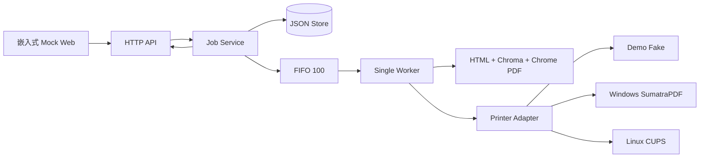

# 课题三结课报告（第 9 天）：浏览器调用本地打印机

## 基本信息

- 结课日期：2026 年 8 月 20 日。
- 开发周期：9 天。
- 完成方式：独立完成。
- 课题：浏览器通过 Go 回环服务调用本地打印能力。
- 本日范围：只整理已有实现、证据和缺口，不新增功能或改变 API。

## 一、摘要

本项目实现了一个面向程序设计竞赛现场的本地打印代理。浏览器向仅监听 `127.0.0.1` 的 Go HTTP 服务提交气球小票或源代码任务；服务将任务持久化后，由容量 100 的单 Worker FIFO 依次完成 HTML 模板、Chrome/Chromium PDF 渲染、打印适配器调用和状态回写。系统提供 7 个 HTTP 接口、嵌入式 Mock Web、JSON 持久化、失败原因、失败任务重试、安全 PDF 预览，以及 Windows SumatraPDF 和 Linux CUPS 两个平台 Adapter。

当前完整可复现证据是 Windows `demo`：脚本自动发现浏览器，health 返回服务标识和 API v1，页面显示“Mock Printer（不执行实体打印）”，任务最终为 `succeeded`，preview 返回 HTTP 200 PDF，停止后端口可重新绑定。Day 5 还保存了真实 Chrome 151 生成的气球单页和源码多页截图。2026-08-21 补验后，Windows `platform` 模式也具备 runtime、系统队列接受和隔离输出的可复现证据。

最终自动验证为 152 个顶层测试：146 通过、6 跳过、0 失败；12 个含测试包通过，race 检查 0 race，vet、module verify 和 diff 检查通过。2026-08-21 补验完成双平台 platform runtime：Windows 在隔离安全队列 `ISO-PDF-Queue` 上真实调用 SumatraPDF 3.6.1，系统队列接受并落盘隔离 PDF，全程连续录屏；Linux 在 WSL2（真实 Linux 内核）上以 CUPS 2.4.7 真实调用 `lp`/`lpstat` 并全量回归通过，取得 request id `iso-queue-8` 并落盘隔离 PDF。真人同学仅看 README 的验收与 Linux 连续录屏仍未完成，本文不以 Fake、受控命令、交叉编译或代理审查替代。

## 二、最终完成矩阵

| 范围 | 状态 | 已有证据 | 未完成边界 |
| --- | --- | --- | --- |
| 气球小票 PDF | 完成 | 真实 Chrome 151 单页；中文和业务字段可见 | 系统队列未提交 |
| 源代码 PDF | 完成 | 140 行 C++ 生成 6 页；高亮、行号、中文、换行和页码通过 | 系统队列未提交 |
| FIFO、五状态、错误与重试 | 完成 | Service/Worker/Store 测试；容量 100；重启恢复 | 平台提交仍存在 at-least-once 崩溃窗口 |
| HTTP API、Mock Web 与 preview | 完成 | 7 路由、200/206 Range、Node VM 行为测试 | 瞬时状态未必被每次 UI 轮询捕获 |
| Windows Adapter | 完成 | 代码、受控 runner、2026-08-21 隔离队列 runtime：系统队列接受并落盘隔离 PDF（任务 `97654d58a864b473735d097571ba6b15`）加连续录屏 | 物理出纸未验证（隔离队列环境，按设计不试投实体设备） |
| Linux Adapter | 完成 | 代码、fixture、交叉编译，以及 2026-08-21 WSL2 真实 Linux 内核 runtime：全量测试通过、CUPS request id `iso-queue-8`、隔离输出落盘（任务 `07381f3ef5c6b9e2a73b86b34ad402d3`） | Linux 连续录屏未完成；物理出纸未验证（隔离队列环境，按设计不试投实体设备） |
| README 与启动脚本 | 完成 | Windows 干净副本 demo 成功 | 真人同学只看 README 未做 |
| 双平台录屏 | 部分完成 | Windows 系统队列连续录屏 `docs/reports/assets/windows-platform-queue-2026-08-21.mp4` | Linux 录屏未完成 |

证据分为五层：代码存在、受控命令测试、对应平台 runtime、系统队列接受、物理或隔离文件输出。低层证据不能替代高层结论。`demo succeeded` 只表示 Fake 接受调用；`platform succeeded` 只表示平台命令成功返回；两者都不自动等于物理出纸。

## 三、场景、目标与范围

竞赛队伍通过题目后，工作人员需要打印气球小票供志愿者派送；队伍需要纸面检查时，可打印带行号的源码。浏览器无法安全、统一地直接枚举和驱动本地打印机，因此页面只提交结构化数据，本地服务负责队列、渲染、平台命令和可观察状态。

九天必做范围为两类业务 PDF、FIFO、任务状态与失败重试、本地 API 与页面、Windows/Linux Adapter 以及可复现文档。明确不做完整 OJ、账号权限、远程访问、云打印、浏览器插件、桌面 GUI、自研驱动、Lodop 集成、多打印机负载均衡和 exactly-once 平台提交。CCPCOJ 与 Lodop 只作场景和方案参考，没有假定未确认接口。

## 四、总体架构



主路径：

```text
POST 创建 -> queued -> rendering -> printing -> succeeded
                         \-> failed <-/
failed --retry--> queued
```

Service 使用随机 128-bit ID，表现为 32 位小写十六进制字符串；单 Worker 保证同一队列 FIFO 和最大并行数 1；JSON Store 负责重启后状态恢复。同一 DataDir 使用平台 advisory lock 强制单实例，避免两个进程同时修改 `jobs.json`。

## 五、HTTP API 与 Web

| 方法 | 路径 | 用途 |
| --- | --- | --- |
| GET | `/health` | 探活与服务识别 |
| GET | `/api/v1/printers` | 查询当前 Adapter 打印机 |
| POST | `/api/v1/print-jobs` | 创建气球或源码任务 |
| GET | `/api/v1/print-jobs` | 查询队列全貌 |
| GET | `/api/v1/print-jobs/{id}` | 查询任务详情 |
| GET | `/api/v1/print-jobs/{id}/preview` | 完整或 Range 预览 PDF |
| POST | `/api/v1/print-jobs/{id}/retry` | 重试失败任务 |

创建请求限制 1 MiB，拒绝未知字段、多余 JSON 值和非法 UTF-8/业务字段。Web 自动探测 `17653-17660` 并验证 health 标识；动态内容只写安全文本节点。默认嵌入页面同源，可选 `file://` 页面必须为每个请求携带本次启动的随机能力值，普通网页 Origin 不获授权。

## 六、两类 PDF 实现与验收

### 气球小票

输入包括比赛名、队伍编号、队伍名称、房间、题号、气球颜色和 RFC3339 通过时间。Go HTML 模板负责转义，CSS 使用 80 x 120 mm、4 mm 边距。真实 Chrome 验收生成 1 页，截图位于：

证据图：`docs/reports/assets/day-05-balloon.png`。

### 源代码

支持 C++、Go、Python、Java。Chroma 生成高亮 token，模板保留原始缩进并显示行号，长行使用可换行结构；Chrome CDP 负责 A4、页眉和“第 n / N 页”页码。140 行中文注释样例生成 6 页：

证据图：`docs/reports/assets/day-05-source-page-1.png` 与
`docs/reports/assets/day-05-source-page-2.png`。

真实 PDF 几何断言验证前两页页眉、正文和页脚互不覆盖。HTML/PDF 先在任务同目录 staging，flush 后原子替换，重试期间 preview 只能读到完整旧版或新版文件。

## 七、双平台打印适配

### Windows

PowerShell/CIM 以 JSON 枚举 `Win32_Printer`；SumatraPDF 参数固定为 `-print-to <枚举名称> -silent <preview.pdf>`。打印机名必须精确属于本轮枚举 allowlist，参数不经 shell。可执行文件与 PDF 均检查完整路径、文件身份和 reparse point，命令超时 30 秒，公开错误不泄露路径或命令输出。

受控 runner 已验证枚举解析、参数顺序、allowlist、超时、文件身份和脱敏。2026-08-21 补验在真实 Windows 11（build 22621）完成 runtime：使用 SumatraPDF 3.6.1 向已确认安全的本地文件端口队列 `ISO-PDF-Queue` 提交气球任务，系统队列接受并落盘 289,600 字节隔离 PDF，任务 `queued -> succeeded`（attempts=1），连续录屏约 4 分 13 秒。该证据证明系统队列接受与隔离输出，不等于物理出纸；证据见 `docs/reports/assets/windows-platform-evidence-2026-08-21.md`。

### Linux

使用 `lpstat -p` 与 `lpstat -d` 枚举，再以 `lp -d <枚举队列> <preview.pdf>` 提交；runner 固定 `LC_ALL=C`。同样要求 allowlist、参数数组、30 秒超时、固定 preview 路径和逐级 symlink 检查。

Linux 测试代码和主应用完成 linux/amd64 交叉编译。2026-08-21 补验在 WSL2 Ubuntu 24.04.4（真实 Linux 内核 6.18）完成 runtime：全量测试（含 race，cgo+gcc）在 Linux 内核通过；platform 模式以非特权用户真实调用 `lp`/`lpstat`，枚举到 CUPS 队列 `iso-queue`，气球任务 `queued -> succeeded`，取得 CUPS request id `iso-queue-8` 并落盘 32362 字节隔离 PDF；SIGINT 优雅退出。该证据证明 Linux runtime 与系统队列接受，不等于物理出纸，且环境为 WSL2，如实标注；证据见 `docs/reports/assets/linux-platform-evidence-2026-08-21.md`。

## 八、错误、安全与恢复

主要稳定错误包括 `INVALID_REQUEST`、`QUEUE_FULL`、`QUEUE_DELIVERY_FAILED`、`RETRY_NOT_ALLOWED`、`STORE_ERROR`、`CONTEXT_CANCELED`、`RENDER_FAILED`、`RENDERER_NOT_FOUND`、`RENDERER_VERSION_UNSUPPORTED`、`PRINTER_NOT_FOUND`、`PRINT_COMMAND_FAILED` 和 `SERVICE_RESTARTED`。

关键安全规则：

1. 只监听 `127.0.0.1`，默认同源；file origin 需启动能力值。
2. job ID 只允许 32 位小写 hex，不接收客户端文件路径。
3. preview 只允许 `jobs/<jobID>/preview.pdf`，拒绝越界、symlink 和 Windows reparse point。
4. 打印机名必须来自本轮枚举，命令使用参数数组而非 shell 拼接。
5. API、持久化错误和日志不公开浏览器、数据目录、Sumatra 或 PDF 的绝对路径，不记录完整源码。
6. `rendering/printing` 在重启恢复时进入 `failed/SERVICE_RESTARTED`，由用户决定是否重试。

平台命令提交存在一个无法由进程内状态消除的窗口：操作系统已经接受命令，但 `succeeded` 尚未落盘时进程崩溃，重试可能重复提交。因此本项目准确声明 at-least-once，不承诺 exactly-once。

## 九、测试与最终结果

| 层级 | 代表覆盖 |
| --- | --- |
| 模型 | 请求规范化、字节边界、状态迁移、生命周期 |
| Store/Service | 唯一 ID、队列满、重试、原子持久化、重启恢复 |
| Worker | FIFO、无重叠、渲染/打印失败、退避、取消 |
| HTTP/Web | 7 路由、body 上限、Range、能力 CORS、真实 JS 行为 |
| Render | 模板转义、高亮、长行、多页、原子发布、路径边界 |
| Printer | 枚举、严格参数、allowlist、超时、路径与脱敏 |
| 生命周期 | 单实例、启动失败释放、HTTP 排空、Worker 清理 |

最终验证：

| 命令 | 结果 |
| --- | --- |
| `go test ./... -count=1` | 152 个顶层测试：146 pass、6 skip、0 fail；12 个含测试包通过 |
| `go test -race ./... -count=1` | 12 个含测试包通过，0 race |
| `go vet ./...` | exit 0 |
| `go mod verify` | `all modules verified` |
| `git diff --check` | exit 0 |

6 个 skip 是 2 个 opt-in 真实 Chrome/服务 E2E、1 个外部 `pdfinfo` 和 3 个普通 Windows 账户不能创建 symlink 的场景。skip 没有写成 pass。Day 5 的真实 Chrome E2E 曾成功并留有截图；Day 7 在受限桌面环境复跑返回 `context canceled`，两次结果按日期分别保留。

## 十、真实问题与改进

| 问题 | 根因 | 修改与复测 |
| --- | --- | --- |
| 源码 Tab 和末尾换行丢失 | 对内容字段误用 `TrimSpace` | 仅判断纯空白，持久化原文；字节保持与 65536/65537 边界通过 |
| Store 故障时 1 ms 忙循环 | 重试无 attempt 和上限 | 5 ms 指数退避、250 ms 封顶；时序和取消通过 |
| Worker 结束后通道/队列未释放 | 生命周期只设计启动和运行 | Close Service，再关闭 Errors/Done；所有权可重新获取 |
| 多页源码页脚覆盖正文 | 页面内 fixed footer 无稳定页边距 | 改用 CDP header/footer 和显式 margin；真实 PDF 几何复测通过 |
| Web 测试只扫描关键词 | 浏览器策略阻断后验证退化 | Node VM 执行真实 `app.js`；发现、渲染、轮询和清理通过 |
| 多进程共享 Store、file origin 过宽 | 缺 DataDir 所有权和来源证明 | 增加实例锁与启动能力；竞争、释放和 CORS 测试通过 |

这些问题说明：接口正确并不代表生命周期完整，HTML/CSS 字符串正确也不代表 PDF 几何正确，代码能交叉编译更不代表对应平台运行通过。后续工作必须继续按可观察证据分层。

## 十一、AI 沟通与独立完成说明

需求梳理、范围决策、架构、编码、测试、演示验证、文档和提交整理均由本人独立完成。AI 用于提示边界案例、检索代码与文档、执行可重复命令和只读审查；所有方案、代码、测试输出和报告结论均由本人逐项复核。

九天中最有效的沟通方式，是同时提供事实源、禁止越界的证据层级和明确输出格式。例如要求“指出测试实际在哪个内核运行、是否调用真实队列、是否产生作业号”，能够阻止把 Linux 交叉编译写成 CUPS 通过；要求“用真实 PDF 几何而非 CSS 字符串验收”，促成了页脚覆盖问题的修复。

不成功的做法是只要求 AI “补充测试或风险”，这种提示容易生成与原文重复的清单，甚至高估 Fake、静态检查或代理审查。后续通过加入“前提 -> 操作 -> 可观察结果”和“未完成项不得替代”的约束，才得到可直接核对的报告。AI/代理审查不是同学验收、平台队列证据或真人录屏。

## 十二、结论与补验计划

九天内已完成可运行的 Go 回环打印代理、两类真实业务 PDF、持久化 FIFO、五状态、失败原因与重试、安全 preview、Mock Web、双平台 Adapter 代码以及可复现 demo 文档。工程上最重要的选择是将业务统一渲染为 PDF，把 Windows/Linux 差异限制在小型 Adapter，并始终区分 Adapter 接受、系统队列接受和物理输出。

按代码与自动验证范围，核心主路径已经完成；按课程完整人工验收，项目仍为“部分完成”。提交前如具备安全环境，按以下顺序补验：

1. 让真人同学只看 README，从全新副本启动；记录环境、耗时、原话卡点、文档修改和同一人复测。
2. ~~在 Windows 配置 SumatraPDF 与已确认的非实体自动保存目标，录制 platform 启动、枚举、任务、队列接受和隔离输出。~~（2026-08-21 已完成：隔离队列 `ISO-PDF-Queue`、任务 `97654d58a864b473735d097571ba6b15`、录屏 `docs/reports/assets/windows-platform-queue-2026-08-21.mp4`。）
3. ~~在 Linux/CUPS 环境运行全量测试，记录 `lpstat`、request id、任务状态和队列结果并录屏。~~（2026-08-21 已完成测试、`lpstat`、request id `iso-queue-8` 与队列结果；仅 Linux 连续录屏仍缺，录制时按 Windows 段同标准执行。）
4. 每段录屏明确说明“平台命令或队列接受不等于物理出纸”；无法确认安全目标时不试投。

## 十三、交付与证据索引

| 材料 | 路径 |
| --- | --- |
| 项目说明 | `README.md` |
| API 文档 | `docs/api.md` |
| 测试说明 | `docs/testing.md` |
| 演示脚本 | `docs/demo-script.md` |
| Day 1-8 日报 | `docs/reports/day-01.md` 至 `day-08.md` |
| Day 1 health 与目录 | `docs/reports/assets/day-01-health.png`、`day-01-project-tree.png` |
| Day 4 Mock Web | `docs/reports/assets/day-04-console.png` |
| Day 5 三张真实 PDF 图 | `docs/reports/assets/day-05-balloon.png`、`day-05-source-page-1.png`、`day-05-source-page-2.png` |
| Windows platform 补验（2026-08-21） | `docs/reports/assets/windows-platform-evidence-2026-08-21.md`（结构化证据）、`windows-platform-queue-2026-08-21.mp4`（连续录屏）、`windows-iso-output-2026-08-21.pdf`（隔离队列产出副本） |
| Linux/CUPS platform 补验（2026-08-21） | `docs/reports/assets/linux-platform-evidence-2026-08-21.md`（结构化证据，含 CUPS request id）、`linux-iso-output-2026-08-21.pdf`（隔离队列产出副本） |
| 固定气球与源码输入 | `testdata/balloon.json`、`testdata/source_cpp.json` |

Windows demo：

```powershell
.\scripts\run-windows.ps1 -Mode demo -GoCachePath '.cache\go-build'
```

Linux demo：

```bash
./scripts/run-linux.sh --mode demo --go-cache .cache/go-build
```

参考资料包括课程《实践指导书》课题三、Go 标准库文档、Chromedp、Chroma、CUPS 命令行打印文档，以及只用于场景/方案比较的 CCPCOJ 和 Lodop 官方资料。
